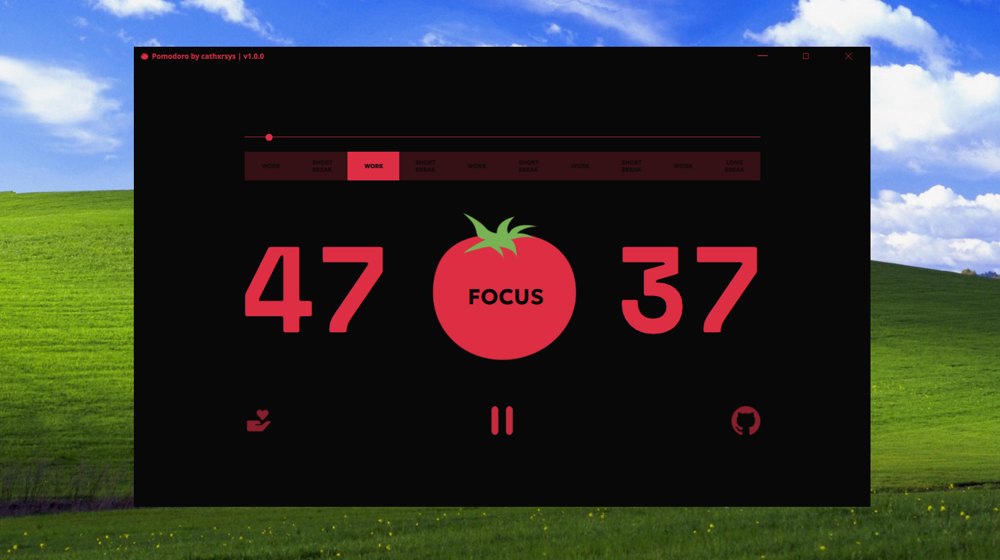

# Pomodoro Timer

A simple and elegant Pomodoro Timer application built with **Qt6**. 

## About

The Pomodoro Technique is a time management method that uses a timer to break work into intervals, 50 minutes in length, separated by short breaks. This application helps you stay focused and productive by managing your work sessions and breaks. 

## Features

- 🍅 Customizable work session duration (in a future)
- ☕ Short and long break intervals
- 🔔 Notifications when timer completes
- 📊 Clean and intuitive user interface
- 🎨 Modern design with Qt6

## Screenshots

### Main Window


### Long Break


## Requirements

- Qt 6.x
- C++17 or later
- CMake 3.16+

## Building

```bash
git clone https://github.com/cathxrsys/pomodoro.git
cd pomodoro

# Make sure you have Qt 6 installed (e.g., via Qt Online Installer or your OS package manager)
# CMake and a C++17-compatible compiler are also required

# Create a build directory and enter it
mkdir build && cd build

# Configure the project with CMake (specify Qt6 path if needed)


# Build the project

```bash
git clone https://github.com/cathxrsys/pomodoro.git
cd pomodoro

### Linux/macOS
```bash
mkdir build
cd build
cmake -DCMAKE_PREFIX_PATH=/path/to/Qt/6.x/gcc_64 ..
cmake --build .
```

### Windows
```bash
mkdir build
cd build
cmake -DCMAKE_PREFIX_PATH=C:\Qt\6.x\msvc2019_64 -G "Visual Studio 17 2022" ..
cmake --build . --config Release
```

### Finding Qt

If CMake can't find Qt automatically, set `CMAKE_PREFIX_PATH` to your Qt installation:

**Linux:** `/home/user/Qt/6.5.0/gcc_64`
**macOS:** `/Users/user/Qt/6.5.0/macos`
**Windows:** `C:\Qt\6.5.0\msvc2019_64`

Alternatively, add Qt to PATH or use Qt Creator which handles this automatically.